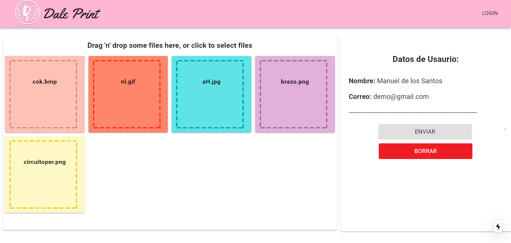

# FrontEnd

Hoy viernes 30 de octubre: deje la UI asi:



Es mas que nada un demo, no se mucho de estilos o diseño xdxdx, pero puedes correr el proyecto para ver los cambios, en si ahorita la unica funcionalidad que tiene es de que puedes arrastrar un archivo a la parte que viene en ingles y luego te aparecera un nuevo cuadro de colores con el nombre del archivo (independientemente de que extension sea xddxd). y asi, 

Pd: Recuerda nunca correr ```npm install ``` en el directorio principal:v, puede que te encuentres con problemas:v

``` cualquier cosa me preguntas:P```

### Dejare el texto original abajo por si lo ocupas:]

----------------------------------------------------------------------------------------------------------------------

This is a [Next.js](https://nextjs.org/) project bootstrapped with [`create-next-app`](https://github.com/vercel/next.js/tree/canary/packages/create-next-app).

## Getting Started

First, run the development server:

```bash
npm run dev
```

Open [http://localhost:3000](http://localhost:3000) with your browser to see the result.

You can start editing the page by modifying `pages/index.js`. The page auto-updates as you edit the file.

## Learn More

To learn more about Next.js, take a look at the following resources:

- [Next.js Documentation](https://nextjs.org/docs) - learn about Next.js features and API.
- [Learn Next.js](https://nextjs.org/learn) - an interactive Next.js tutorial.

You can check out [the Next.js GitHub repository](https://github.com/vercel/next.js/) - your feedback and contributions are welcome!

## Deploy on Vercel

The easiest way to deploy your Next.js app is to use the [Vercel Platform](https://vercel.com/import?utm_medium=default-template&filter=next.js&utm_source=create-next-app&utm_campaign=create-next-app-readme) from the creators of Next.js.

Check out our [Next.js deployment documentation](https://nextjs.org/docs/deployment) for more details.
